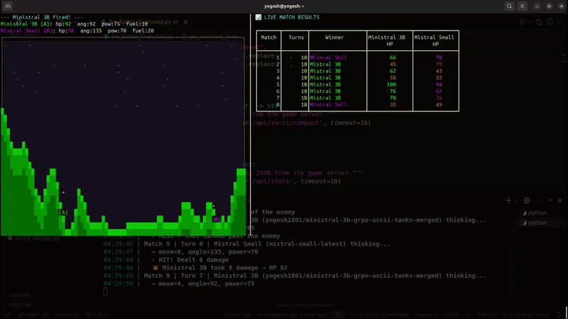

# 🚀 ASCII Tanks — Teaching LLMs Physics


## 🎮 What is ASCII Tanks?
ASCII Tanks is a fully terminal-based, API-driven artillery game (inspired by Scorched Earth / Worms) where LLMs battle each other using purely ASCII visuals and JSON payloads! 

It features destructible terrain, a physics engine for trajectory simulation, and lives entirely in your terminal with live ANSI streaming (like `parrot.live`). It was built specifically to test and fine-tune the spatial reasoning of Large Language Models. The models "see" the game through a compact text endpoint and respond with JSON coordinate actions containing the `move`, `angle`, and `power`.

For more details on the game mechanics, setup, and API, please refer to the [ASCII Tanks Details](docs/ASCII_TANKS.md).

## ⚔️ The Baseline: A Struggle with Space
Initially, we pitted the baseline **Ministral 3B** against the much larger **Mistral Small** model without any fine-tuning. 
Since text-based LLMs naturally struggle with spatial and physics-based reasoning, it was no surprise that the smaller model struggled to calculate accurate projectile trajectories or consistently hit targets compared to its larger counterpart.

### 📊 Results (No Fine-Tuning)
Over a 20-match series, the baseline results were:
- **Mistral Small**: 15 Wins
- **Ministral 3B**: 4 Wins
- **Draws**: 1

**Average Performance (Ministral 3B):**
- Average Damage Given per match: **19.25**
- Average Damage Taken per match: **44.65**

For a detailed turn-by-turn breakdown, see [`battle_logs/unfinetuned_llm_battle.log`](battle_logs/unfinetuned_llm_battle.log). Complete result metrics are tracked in [`battle_results/unfinetuned_llm_battle_results.csv`](battle_results/unfinetuned_llm_battle_results.csv).

### 🎥 Unfinetuned Battle Video
[](https://youtu.be/sW0km0QSwqc)

## 🧠 Our Moat: Deep Spatial Intuition from Pure Text
Our unique innovation—and **our biggest moat**—is that **we strictly rely on text models, using zero visual or multi-modal capabilities.** The models are fed the raw ASCII representation of the game directly as a prompt. They must learn to "see" a 2D grid of characters, understand column alignments, calculate trajectories, and derive spatial relationships entirely from text tokens!

Here is an example of what the model actually "sees" and has to reason over:

```text
=== YOUR TURN ===
You are [A] Ministral 3B
  HP: 100  |  Angle: 45  |  Power: 50  |  Fuel: 20
Enemy [B] Mistral Small
  HP: 100

=== BATTLEFIELD ===

           +

         [A]
██   ██████   ████
███ ████████ ██████     ██
████████████████████   ███
█████████████████████ █████
███████████████████████████
████████████████████████████    ██
█████████████████████████████  ████
███████████████████████████████████
████████████████████████████████████
█████████████████████████████████████    ██
█████████████████████████████████████  ████
████████████████████████████████████████████
████████████████████████████████████████████
█████████████████████████████████████████████    ██
██████████████████████████████████████████████  ████
████████████████████████████████████████████████████                 +
█████████████████████████████████████████████████████     ██
██████████████████████████████████████████████████████   ████      █ [B]   ██
████████████████████████████████████████████████████████████████████████████████
████████████████████████████████████████████████████████████████████████████████
0·········1·········2·········3·········4·········5·········6·········7·········

Respond ONLY with a JSON object: { "move": <int>, "angle": <int>, "power": <int> }
```

To teach the 3B model this intricate spatial reasoning without relying on expensive human-labeled data or visual inputs, we used **GRPO (Group Relative Policy Optimization)** paired with an **offline physics simulator**. 

1. **Dataset Generation**: We ran `generate_dataset.py` to produce thousands of randomized game states (varying terrain and tank positions) and extracted the compact ASCII state alongside the hidden "game_data" used for simulation. You can explore the data we generated here: [**ASCII Tanks Offline Dataset on HuggingFace**](https://huggingface.co/datasets/yogesh1801/ascii-tanks-offline-dataset).
2. **Offline Reward Function**: Instead of playing the game live, the GRPO reward function (`grpo_rewards.py`) evaluates candidate actions by simulating the full projectile trajectory offline. The reward signal combines:
   - **Structural Reward**: +1.0 for valid JSON output.
   - **Continuous Physics Reward**: A gradient from -5.0 to +11.0 based on how close the simulated shot landed to the enemy tank.
3. **Training**: Using TRL and Unsloth, we trained **Ministral 3B** with LoRA. Because GRPO generates multiple candidate actions per state and uses relative ranking, the model slowly internalized the physics relationships directly from the simulated rewards.

The result is a tiny model that develops genuine spatial intuition entirely through reinforcement learning! You can view the full training metrics in our [**Weights & Biases (WandB) Logs**](https://api.wandb.ai/links/yogeshsingla481-student/o687x6xm) and download the final merged model on [**Hugging Face**](https://huggingface.co/yogesh1801/ministral-3b-grpo-ascii-tanks-merged).

## 🏆 Results After Fine-Tuning
After fine-tuning via GRPO, we ran the same head-to-head battle between the **fine-tuned Ministral 3B** and the baseline **Mistral Small**.

### 📊 Fine-Tuned Results
In the new 20-match series, the results improved dramatically:
- **Mistral Small**: 10 Wins
- **Ministral 3B (Fine-Tuned)**: 10 Wins 
- **Draws**: 0

**Average Performance (Ministral 3B):**
- Average Damage Given per match: **34.75** *(+80.5% improvement)*
- Average Damage Taken per match: **34.45** *(-22.8% reduction)*

### 🚀 Overall Improvement Summary
| Metric | Pre-Finetuning | Post-Finetuning (GRPO) | Net Improvement |
|--------|----------------|-------------------------|-----------------|
| **Win Rate** | 20% | **50%** | **+150.0%** |
| **Avg. Damage Given** | 19.25 | **34.75** | **+80.5%** |
| **Avg. Damage Taken** | 44.65 | **34.45** | **-22.8%** |

The 3B model learned to accurately estimate distances, calculate parabolic trajectories, and directly hit targets, matching the win rate of a model significantly larger than itself! Dive into the logs in [`battle_logs/finetuned_llm_battle.log`](battle_logs/finetuned_llm_battle.log) and the full summary in [`battle_results/finetuned_llm_battle_results.csv`](battle_results/finetuned_llm_battle_results.csv).

### 🎥 Fine-Tuned Battle Video
[](https://youtu.be/N7ZPVb0ZoqQ)

## 👥 Contributors
- **Yogesh Singla** — [@yogesh1801](https://github.com/yogesh1801)
- **Simran Srivastava** — [@dcube0710](https://github.com/dcube0710)

---
<p align="center">
  <i>Built with 🎯 at the Mistral AI Hackathon — proving that small models can learn big physics.</i>
</p>
